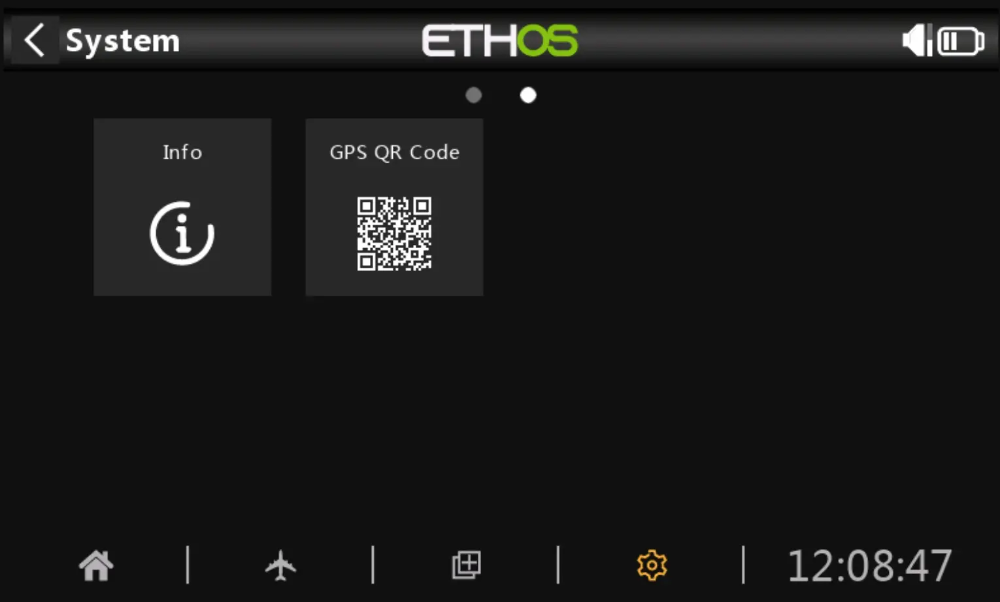
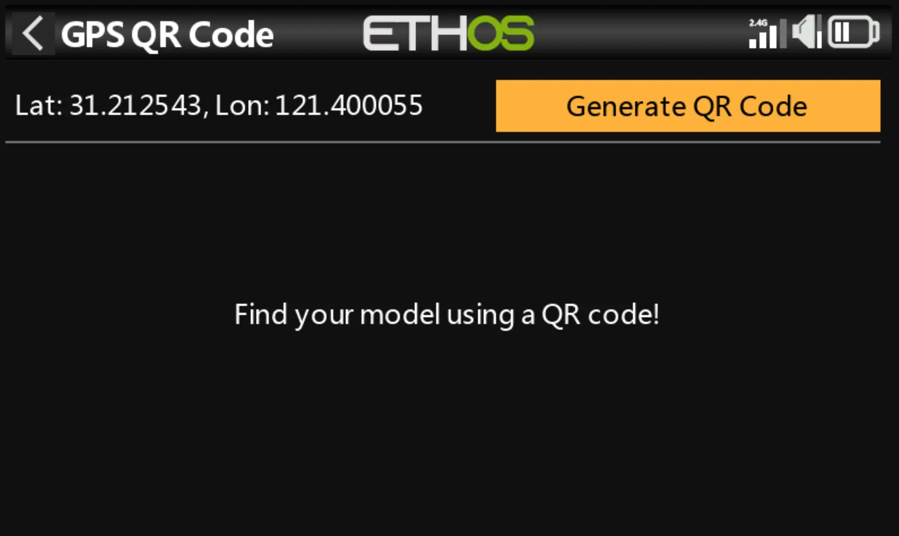
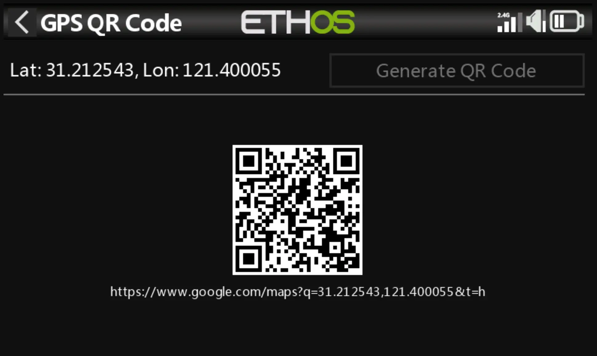

# ethos-gps-qrcode  [[download]](https://github.com/flyingeek/ethos-gps-qrcode/releases/latest)

A tool to show your last gps position in Google Maps via a QRCode.

This utility is installed is the System Menu of your Radio. It does not consume any resource until you open it to generate a QRCode.

Once a GPS Signal is received, you can generate a QR Code to open the Google Maps application with your phone.

If you loose your model, do not turn off the radio immediatly, instead, scan the last recorded position first.

## Demo

https://github.com/user-attachments/assets/ee7e2cc6-ae79-49b7-ae65-93c46701dc57

## Compatibility

Localisation in en/fr/de/es/it/cs using AI.

Requirement: Ethos >= 1.5.18
